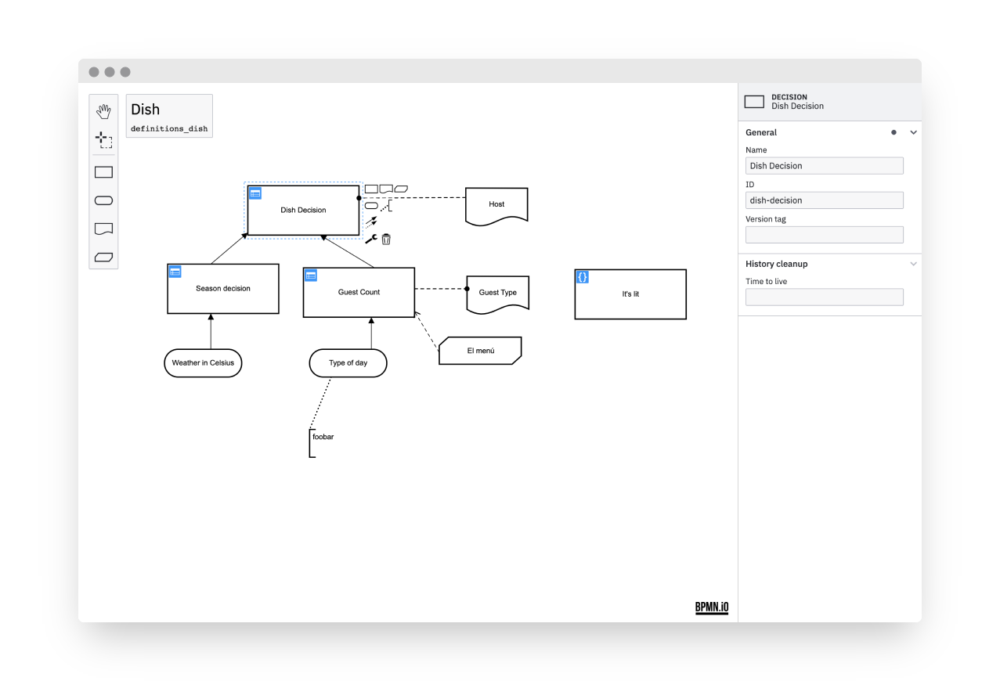

# dmn-js-properties-panel

[](https://github.com/bpmn-io/dmn-js-properties-panel/actions?query=workflow%3ACI)

This is properties panel extension for [dmn-js](https://github.com/bpmn-io/dmn-js).



## Features

The properties panel allows users to edit invisible DMN properties in a convenient way.

Some of the features are:

* Edit element ids and names
* Edit execution related [Camunda](http://camunda.org) properties
* Redo and undo (plugs into the [dmn-js](https://github.com/bpmn-io/dmn-js) editing cycle)


## Usage

Provide two HTML elements, one for the properties panel and one for the DMN diagram:

```html
<div class="modeler">
  <div id="canvas"></div>
  <div id="properties"></div>
</div>
```

Bootstrap [dmn-js](https://github.com/bpmn-io/dmn-js) with the properties panel, and a [properties provider](./lib/provider):

```javascript
import DmnModeler from 'dmn-js/lib/Modeler';

import {
  DmnPropertiesPanelModule,
  DmnPropertiesProviderModule,
} from 'dmn-js-properties-panel';

var dmnModeler = new DmnModeler({
  drd: {
    propertiesPanel: {
      parent: '#properties'
    },
    additionalModules: [
      DmnPropertiesPanelModule,
      DmnPropertiesProviderModule
    ]
  },
  container: '#canvas'
});
```


### Dynamic Attach/Detach

You may attach or detach the properties panel dynamically to any element on the page, too:

```javascript
var propertiesPanel = dmnJS.get('propertiesPanel');

// detach the panel
propertiesPanel.detach();

// attach it to some other element
propertiesPanel.attachTo('#other-properties');
```


### Use with Camunda properties

In order to be able to edit [Camunda](https://camunda.org) related properties, use the [camunda properties provider](./lib/provider/camunda).
In addition, you need to define the `camunda` namespace via [camunda-dmn-moddle](https://github.com/camunda/camunda-dmn-moddle).

```javascript
import DmnModeler from 'dmn-js/lib/Modeler';
import {
  DmnPropertiesPanelModule,
  DmnPropertiesProviderModule,
  CamundaPropertiesProviderModule
} from 'dmn-js-properties-panel';


// use Camunda properties provider
import CamundaPropertiesProvider from 'src/provider/camunda';

// a descriptor that defines Camunda related DMN 1.1 XML extensions
import camundaModdleDescriptor from 'camunda-dmn-moddle/resources/camunda';

var dmnModeler = new DmnModeler({
  drd: {
    propertiesPanel: {
      parent: '#properties'
    },
    additionalModules: [
      DmnPropertiesPanelModule,
      DmnPropertiesProviderModule,
      CamundaPropertiesProviderModule
    ]
  },
  container: '#canvas'
  // make camunda prefix known for import, editing and export
  moddleExtensions: {
    camunda: camundaModdleDescriptor
  }
});

...
```


## Additional Resources

* [Issue tracker](https://github.com/bpmn-io/dmn-js-properties-panel)
* [Forum](https://forum.bpmn.io)


## Development

### Running the tests

```bash
npm install

export TEST_BROWSERS=Chrome
npm run all
```


## License

MIT
